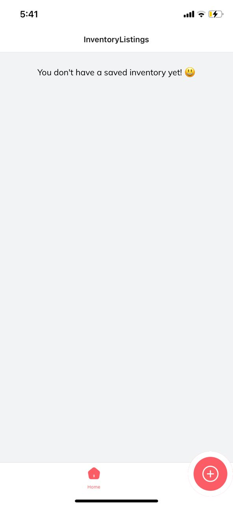
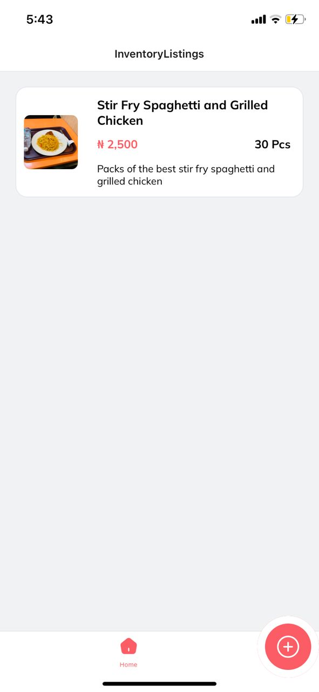
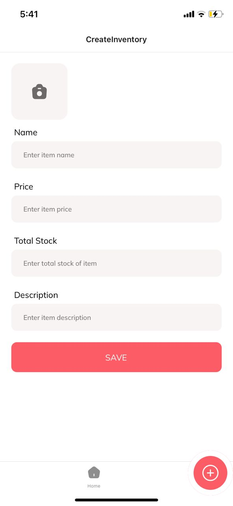
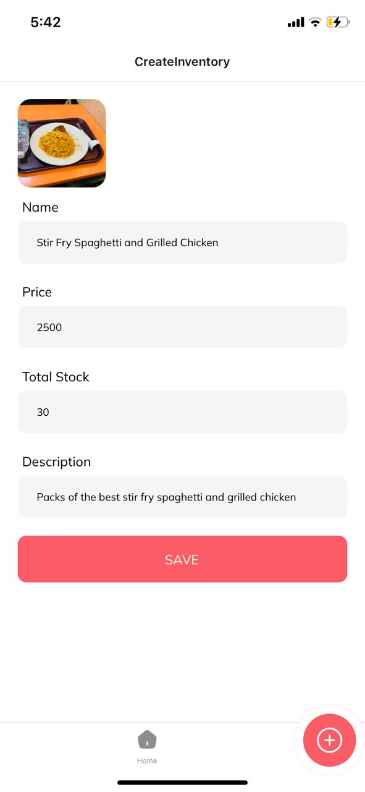
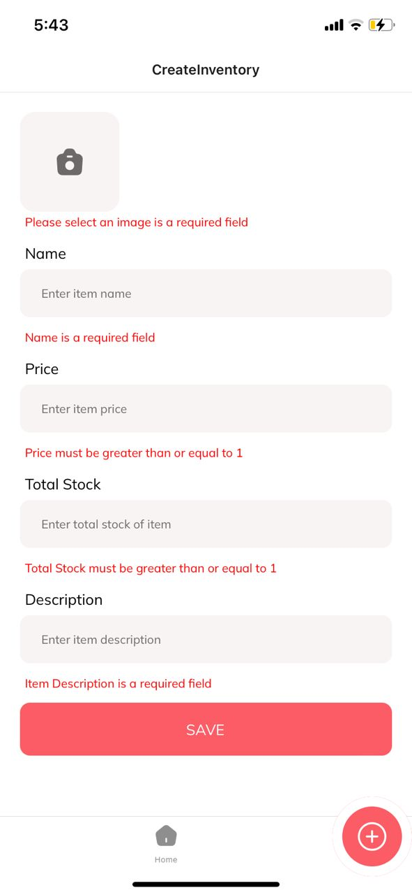
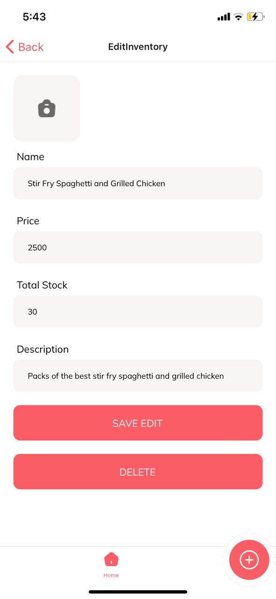

# Inventory Manager App

Welcome to the Inventory Manager app, a React Native application built for managing inventory items. This app allows users to list, add, edit, and delete inventory items using AsyncStorage as a data store.

## Features

- **Inventory Listing**: View a list of inventory items with their images, names, prices, and total stock. Includes a button for adding more items.
- **Create Inventory**: Create new inventory items by filling out a form with fields for name, total stock, price, and description. Validates input fields for required information and format.

- **Edit Inventory**: Edit existing inventory items by modifying their name, total stock, price, and description. Validates input fields for required information and format.

- **Delete Inventory**: Delete an existing item from the inventory. Confirmation popup ensures user confirmation before deletion.

## Getting Started

To get started with the project, follow these steps:

### Installation

1. Clone the repository to your local machine:

```bash
git clone <repository-url>
```

2. Navigate to the project directory:

```bash
cd bluemoon-inventory
```

3. Install dependencies using Yarn:

```bash
yarn install
```

### Running the App

1. Start the project using Yarn:

```bash
yarn start
```

2. Open Expo Go on your mobile device.

3. Scan the QR code shown in the terminal with Expo Go.

4. Wait for the app to build and load on your device.

## Screenshots

### Inventory Listing





This screen displays a list of inventory items with their images, names, prices, and total stock. It also includes a button for adding more items.

### Create Inventory







This screen allows users to create new inventory items by filling out a form with fields for image, name, total stock, price, and description. Validation ensures that all required fields are filled and that input formats are correct.

### Edit Inventory



Users can edit existing inventory items by modifying their image, name, total stock, price, and description on this screen. Like the create inventory screen, validation ensures that all required fields are filled and that input formats are correct.

### Delete Inventory


The delete inventory screen shows a confirmation popup when trying to delete an existing item from the inventory. This ensures user confirmation before proceeding with the deletion.

## Technologies Used

- Expo
- React Native
- React Navigation
- AsyncStorage
- TypeScript

## Author

[Franklin Okolie](https://github.com/DeveloperAspire)

## License

This project is licensed under the [MIT License](LICENSE).
